# 活動報名管理系統 — 系統文件

## 一、系統簡介

本系統為一套以 **Java + JavaFX** 開發的校園活動報名管理平台，採用 **SOLID 五原則重構版** MVC 架構設計，支援兩種角色登入：**學生（Student）** 與 **主辦者（Organizer）**，資料以純文字檔（`data/users.txt`、`data/events.txt`）做持久化儲存。

---

## 二、功能概覽

### 學生端功能
| 功能 | 說明 |
|------|------|
| 登入 / 註冊 | 以帳號、密碼與角色身份登入；可自助完成新帳號註冊 |
| 瀏覽活動 | 查看全部活動，顯示代碼、主題、地點、時間、名額與狀態 |
| 關鍵字搜尋 | 即時依活動主題或地點關鍵字篩選清單 |
| 報名活動 | 選定活動後報名，系統自動驗證重複報名與人數上限 |
| 取消報名 | 取消已報名的活動，同步更新雙向物件關聯 |
| 已報名清單 | 切換顯示僅已報名之活動 |

### 主辦者端功能
| 功能 | 說明 |
|------|------|
| 登入 / 註冊 | 需填寫所屬主辦單位 |
| 新增活動 | 填寫主題、地點、時間、人數、描述，自動產生流水號 ID |
| 修改活動 | 修改各欄位；人數限制不可低於已報名人數 |
| 刪除活動 | 串級清除所有學生的對應報名紀錄 |
| 查看名冊 | 以物件關聯直接取得報名學生姓名與學號 |
| 匯出 CSV | 將選定活動的報名名冊輸出至 `exports/` 資料夾 |

---

## 三、技術架構（SOLID 重構版）

```
活動報名管理系統
├── 表現層 (View)              JavaFX FXML 介面檔案
│   ├── login-view.fxml
│   ├── student-view.fxml
│   └── organizer-view.fxml
│
├── 控制層 (Controller)
│   ├── LoginController        登入、註冊，Map 角色派發（OCP）
│   ├── StudentController      學生功能，依賴 DataContext（DIP）
│   └── AdminController        主辦者功能，依賴 DataContext（DIP）
│
├── 模型層 (Model)
│   ├── User                   抽象父類別，含序列化鉤子（OCP）
│   ├── Student                學生（繼承 User）
│   ├── Organizer              主辦者（繼承 User）
│   ├── Event                  活動實體
│   └── UserFactory            角色工廠，消除 if-else（OCP）
│
├── 資料層 (Repository)
│   ├── IUserRepository        使用者存取介面（ISP）
│   ├── IEventRepository       活動存取介面（ISP）
│   ├── IRelationshipResolver  關聯解析介面（ISP）
│   ├── FileUserRepository     僅負責 users.txt（SRP）
│   ├── FileEventRepository    僅負責 events.txt（SRP）
│   ├── RelationshipResolver   僅負責物件關聯解析（SRP）
│   ├── DataContext            依賴注入協調者（DIP）
│   └── FileRepository         向後相容薄包裝（Facade）
│
└── 例外層 (Exception)
    ├── CapacityFullException      人數已滿
    └── DuplicateRegisterException 重複報名
```

### 依賴流向（Composition Root）

```
App.java (唯一知道具體類別的地方)
  │
  ├── new FileUserRepository()   ─┐
  ├── new FileEventRepository()  ─┼──► DataContext
  └── new RelationshipResolver() ─┘        │
                                            ▼
                                     LoginController
                                    StudentController   (皆只依賴 DataContext 介面)
                                     AdminController
```

---

## 四、類別圖

```mermaid
classDiagram
    direction TB

    %% ══════════════════════════════════════════
    %% 介面層（ISP）
    %% ══════════════════════════════════════════
    class IUserRepository {
        <<interface>>
        + loadUsers() List~User~
        + saveUsers(List~User~) void
    }

    class IEventRepository {
        <<interface>>
        + loadEvents() List~Event~
        + saveEvents(List~Event~) void
    }

    class IRelationshipResolver {
        <<interface>>
        + resolveRelationships(List~User~, List~Event~) void
    }

    %% ══════════════════════════════════════════
    %% 模型層
    %% ══════════════════════════════════════════
    class User {
        <<abstract>>
        # String id
        # String name
        # String password
        # String role
        + displayMenu()* void
        + getSerializedExtra()* String
        + applySerializedExtra(String) void
    }

    class Student {
        - List~Event~ registeredEvents
        - List~String~ tempRegisteredEventIds
        + registerEvent(Event) void
        + cancelEvent(Event) void
        + getSerializedExtra() String
        + applySerializedExtra(String) void
    }

    class Organizer {
        - String organization
        - List~Event~ hostedEvents
        + createEvent(Event) void
        + editEvent(Event) void
        + getSerializedExtra() String
    }

    class Event {
        - String id
        - String title
        - String location
        - String time
        - int capacity
        - String description
        - Organizer organizer
        - List~Student~ participants
        + registerStudent(Student) void
        + cancelStudent(Student) void
        + isFull() boolean
        + getStatus() String
    }

    class UserFactory {
        <<static>>
        - Map~String,UserCreator~ registry
        + register(String, UserCreator) void
        + create(String,String,String,String,String) User
        + isRegistered(String) boolean
    }

    %% ══════════════════════════════════════════
    %% 資料層（SRP：各類別僅一職責）
    %% ══════════════════════════════════════════
    class FileUserRepository {
        + loadUsers() List~User~
        + saveUsers(List~User~) void
    }

    class FileEventRepository {
        + loadEvents() List~Event~
        + saveEvents(List~Event~) void
    }

    class RelationshipResolver {
        + resolveRelationships(List~User~, List~Event~) void
    }

    class DataContext {
        - IUserRepository userRepository
        - IEventRepository eventRepository
        - IRelationshipResolver resolver
        + loadUsers() List~User~
        + saveUsers(List~User~) void
        + loadEvents() List~Event~
        + saveEvents(List~Event~) void
        + resolveRelationships(List~User~, List~Event~) void
    }

    %% ══════════════════════════════════════════
    %% 例外層
    %% ══════════════════════════════════════════
    class CapacityFullException {
        - String eventTitle
        + getEventTitle() String
    }

    class DuplicateRegisterException {
        - String eventTitle
        + getEventTitle() String
    }

    %% ══════════════════════════════════════════
    %% 控制層
    %% ══════════════════════════════════════════
    class LoginController {
        - DataContext context
        - Map~String,ViewOpener~ viewOpeners
        + setContext(DataContext) void
        + handleLogin(ActionEvent) void
        + handleRegisterDialog(ActionEvent) void
    }

    class StudentController {
        - DataContext context
        - Student currentStudent
        + initData(DataContext, Student) void
        + handleRegisterEvent(ActionEvent) void
        + handleCancelRegistration(ActionEvent) void
    }

    class AdminController {
        - DataContext context
        - Organizer currentOrganizer
        + initData(DataContext, Organizer) void
        + handleCreateEvent(ActionEvent) void
        + handleEditEvent(ActionEvent) void
        + handleDeleteEvent(ActionEvent) void
        + handleExportCsv(ActionEvent) void
    }

    %% ══════════════════════════════════════════
    %% 繼承關係（LSP）
    %% ══════════════════════════════════════════
    User        <|-- Student
    User        <|-- Organizer
    Exception   <|-- CapacityFullException
    Exception   <|-- DuplicateRegisterException

    %% ══════════════════════════════════════════
    %% 介面實作關係（DIP）
    %% ══════════════════════════════════════════
    IUserRepository       <|.. FileUserRepository
    IEventRepository      <|.. FileEventRepository
    IRelationshipResolver <|.. RelationshipResolver

    %% ══════════════════════════════════════════
    %% DataContext 依賴介面（DIP + ISP）
    %% ══════════════════════════════════════════
    DataContext o-- IUserRepository
    DataContext o-- IEventRepository
    DataContext o-- IRelationshipResolver

    %% ══════════════════════════════════════════
    %% 物件關聯（雙向 OOP）
    %% ══════════════════════════════════════════
    Event    "many" --> "1"    Organizer : 由主辦者主持
    Event    "many" --> "many" Student   : participants
    Student  "1"    --> "many" Event     : registeredEvents
    Organizer "1"   --> "many" Event     : hostedEvents

    %% ══════════════════════════════════════════
    %% 例外拋出
    %% ══════════════════════════════════════════
    Event ..> CapacityFullException      : throws
    Event ..> DuplicateRegisterException : throws

    %% ══════════════════════════════════════════
    %% 控制器依賴（皆依賴 DataContext，非具體實作）
    %% ══════════════════════════════════════════
    LoginController   ..> DataContext
    StudentController ..> DataContext
    AdminController   ..> DataContext

    %% ══════════════════════════════════════════
    %% UserFactory 被 Repository 使用（OCP）
    %% ══════════════════════════════════════════
    FileUserRepository ..> UserFactory
```



---

## 五、SOLID 五原則對照

### S — 單一職責原則（SRP）

| 類別 | 唯一職責 |
|------|---------|
| `FileUserRepository` | 只負責 `users.txt` 的讀寫 |
| `FileEventRepository` | 只負責 `events.txt` 的讀寫 |
| `RelationshipResolver` | 只負責將 ID 字串解析為物件參考 |
| `DataContext` | 只負責組合三個存取物件，提供統一入口 |
| `UserFactory` | 只負責依角色字串建立 User 實例 |

> 重構前：`FileRepository` 同時承擔上述五項職責。

---

### O — 開放封閉原則（OCP）

**新增角色時，零修改現有程式碼：**

```java
// 1. 建立新子類別
public class Teacher extends User { ... }

// 2. 只需在兩處各加一行
UserFactory.register("Teacher",
    (id, pw, name, extra) -> new Teacher(id, pw, name));

viewOpeners.put("Teacher",
    (stage, user) -> openTeacherView(stage, (Teacher) user));
```

**序列化鉤子（OCP）：**
- `getSerializedExtra()` / `applySerializedExtra()` 為模板方法鉤子
- `FileUserRepository.saveUsers()` 呼叫 `u.getSerializedExtra()`，無需 `instanceof`
- 新增角色只需在子類別覆寫鉤子，存取層程式碼不動

---

### L — 里氏替換原則（LSP）

`Student` 與 `Organizer` 完整覆寫 `displayMenu()`、`getSerializedExtra()`，  
可在所有接受 `User` 的地方安全替換，行為一致。

---

### I — 介面隔離原則（ISP）

| 介面 | 使用者 |
|------|--------|
| `IUserRepository` | `DataContext`（使用者存取） |
| `IEventRepository` | `DataContext`（活動存取） |
| `IRelationshipResolver` | `DataContext`（關聯解析） |

三個介面窄而精，控制器透過 `DataContext` 取得所需介面，不被迫依賴不相關方法。

---

### D — 依賴反轉原則（DIP）

```
高層模組 Controller ──依賴──► DataContext（抽象協調者）
                                      │
                              依賴三個介面
                        ┌─────┴──────────────────┐
               IUserRepository  IEventRepository  IRelationshipResolver
                      ↑                ↑                   ↑
             FileUserRepository  FileEventRepository  RelationshipResolver
                                （具體實作，只在 App.java 被 new）
```

`App.java` 是唯一的 **Composition Root**（組裝點），是整個系統中唯一知道具體類別的地方。

---

## 六、資料格式

### `data/users.txt`
每行一筆，以 `|` 分隔：

| 欄位 | 說明 |
|------|------|
| role | `Student` 或 `Organizer` |
| id | 帳號（學號 / 員工編號）|
| password | 密碼 |
| name | 真實姓名 |
| extra | 學生：已報名活動 ID（分號分隔）；主辦者：所屬單位 |

```
Student|student1|password|王小明|E001;E003
Organizer|admin|admin|系學會會長|資訊工程系學會
```

### `data/events.txt`
每行一筆，共 8 個欄位：

```
id|title|location|time|capacity|description|organizerId|participantIds(;分隔)
```

---

## 七、核心設計亮點

### 雙向物件關聯（Bidirectional OOP）
`Event.registerStudent()` 呼叫時，同步維護：
- `Event.participants.add(student)`
- `Student.registeredEvents.add(event)`

刪除時同樣雙向清除，保持記憶體物件圖的一致性。

### 關聯解析器（RelationshipResolver）
從檔案讀入的是扁平 ID 字串，`resolveRelationships()` 在進入主畫面時，將 ID 解析為物件參考，重建雙向物件關係圖。此職責已從 `FileRepository` 獨立為專職類別（SRP）。

### 自訂例外控制流程（LSP + SRP）
`CapacityFullException` 與 `DuplicateRegisterException` 在 `Event` 的報名方法中拋出，由 `StudentController` 的 try-catch 捕捉並以 Alert 視窗告知使用者，例外語意清晰，職責分離。

### Composition Root（App.java）
整個系統中唯一 `new` 具體實作的地方是 `App.java`，所有控制器都透過介面依賴注入，實現真正的依賴反轉。
